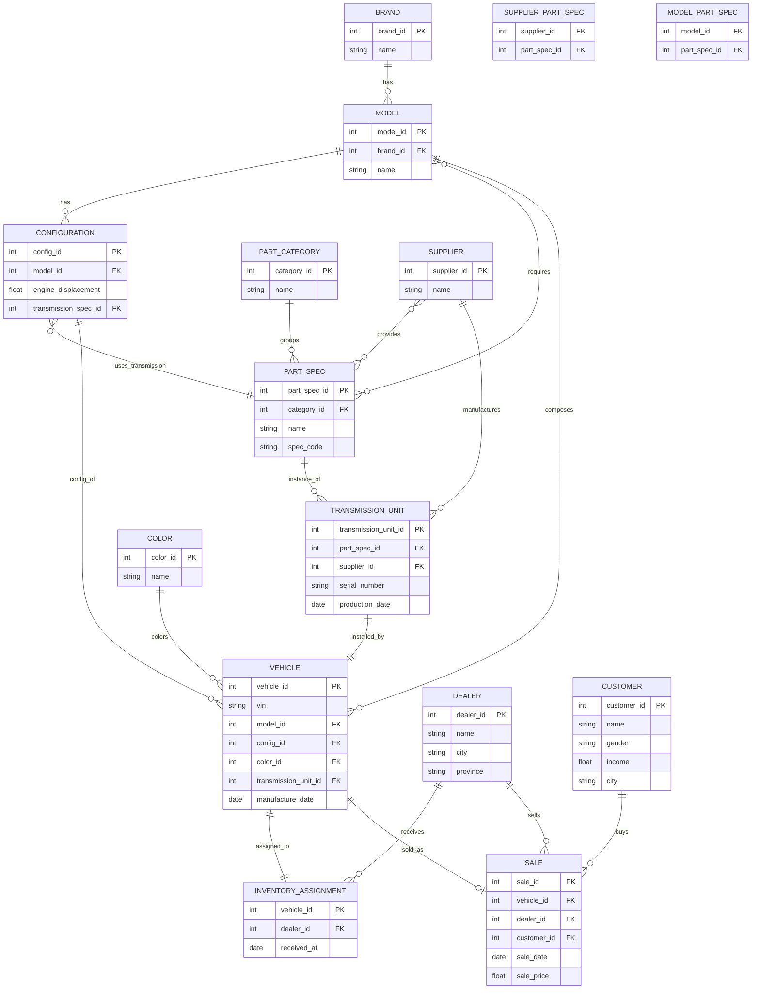

# 数据库实验 2

## 一、实验名称

数据库设计实验

目标：本实验是数据库综合实验，包括概念设计，逻辑设计，数据库实施，操作和维护的关系数据库和相关的应用程序的设计。

应用说明：该数据库应用程序是一家国产汽车公司，如比亚迪、长城、 吉利或 奇瑞等。

在选定的汽车公司中， 公司需要保留相当多的数据，重点关注公司运营的以下几个方面。

- 车辆：每辆车有一个唯一的车辆识别号（VIN）。VIN 可以百度，也可以自己编写。

- 品牌：每个公司可能有几个品牌（例如，长城汽车有哈佛 HAVAL, 魏 WEY, 坦克 TANK等）

- 车型：每个品牌提供几种车型（例如哈佛 H2, H4, H6, H7, H9 等 ）。

- 配置：车的颜色，发动机排量、变速器等。

- 经销商：经销商从制造商处购买车辆并将其出售给客户。可以按日期、品牌、型号和颜色跟踪销售情况；

- 供应商：供应商为某些型号提供某些零件；

- 客户：购买汽车的客户，包括姓名、地址、电话、性别和年收入等。

数据生成：为了简单起见，不需要实际的数据。你可以创建一些名字或者从汽车公司的网站上获取真实的名字，或者适用爬虫从汽车网站上获取。

## 二、实验内容

1. 实体联系模型

- 构建代表数据库概念设计的 E-R 模型。

2. 关系模型

- 从 E-R 设计中创建初始关系设计后，根据关系设计原则对其进行优化。

- 基于 OPENGAUSS 创建该关系数据库。

- 根据需要创建索引和约束。

3. 数据初始化

- 包含足够的数据，使您的查询答案有趣且不平凡，以供测试之用。

- 建议用大模型生成。

4. 查询：运行一些测试查询，以查看是否按预期的方式加载了数据库。

- 显示过去 3 年各品牌的销售趋势，按年、月分列。然后将这些数据按购买者的性别和收入范围进行分类。

- 假设发现供应商“爱信”在两个给定日期之间进行的变速器存在缺陷。找到每辆装有这种变速器的汽车的车辆识别号（VIN）以及向其销售的客户。

- 按过去一年的销售金额找出前两大品牌。

- 根据过去一年的单位销售额找出前两大品牌。

- 某种车型（例如 H4）在哪个月卖得最好？

- 找到平均库存时间最长的经销商。

5. （选做）设计一个应用程序完成（ 4 ）中相关功能。可以是 C++,JAVA,PYTHON，程序结构可以是单机，也可以是 GUI 应用程序，也可以是 WEB 应用。

## 三、实验报告要求

本实验提交 WORD 文档，格式自拟，文件名为 学号+姓名+实验 1 。其中需要包含：

1. E-R 图，以及相关解释性说明。

2. 关系模式（逻辑模型）。

3. 表结构（物理模型）。

4. 一组示例查询。

5. （选做）运行界面截图。另外单独打包提交提供程序源代码，可执行文件。

## 四、概念与逻辑设计方案

### 1. 实体联系模型（E-R）



基数/可选性说明：
- 每个品牌对应多个车型；每个车型对应多个配置。
- 配置引用一条“变速器规格”（`PartSpec`，类别为 Transmission）。
- 每台变速器实物（`TransmissionUnit`）由唯一供应商生产并对应某一变速器规格。
- 每辆车安装且仅安装一台具体的变速器实物（1:1）。
- 每辆车在单一经销商处入库一次（2a），有且仅有一条入库记录。
- 每辆车零或一次销售记录；每张销售单必须关联车辆、经销商与客户。
- 车型与零件规格、供应商与零件规格均为多对多，使用连接表建模。

### 2. 关系模型（3NF）

以下为逻辑模式（面向 OpenGauss/PostgreSQL 语法风格），给出主键/外键/唯一/检查等约束。实际执行可在实施阶段微调数据类型与约束细节。

```sql
-- 维度与主数据
CREATE TABLE brand (
  brand_id       BIGSERIAL PRIMARY KEY,
  name           VARCHAR(100) NOT NULL UNIQUE
);

CREATE TABLE model (
  model_id       BIGSERIAL PRIMARY KEY,
  brand_id       BIGINT NOT NULL REFERENCES brand(brand_id),
  name           VARCHAR(100) NOT NULL,
  UNIQUE (brand_id, name)
);

CREATE TABLE color (
  color_id       BIGSERIAL PRIMARY KEY,
  name           VARCHAR(50) NOT NULL UNIQUE
);

CREATE TABLE part_category (
  category_id    BIGSERIAL PRIMARY KEY,
  name           VARCHAR(50) NOT NULL UNIQUE
  -- 建议包含固定枚举行，如 ('Transmission'), ('Engine'), ...
);

CREATE TABLE part_spec (
  part_spec_id   BIGSERIAL PRIMARY KEY,
  category_id    BIGINT NOT NULL REFERENCES part_category(category_id),
  name           VARCHAR(100) NOT NULL,
  spec_code      VARCHAR(100) NOT NULL UNIQUE
);

CREATE TABLE supplier (
  supplier_id    BIGSERIAL PRIMARY KEY,
  name           VARCHAR(100) NOT NULL UNIQUE
);

-- 连接关系（多对多）
CREATE TABLE supplier_part_spec (
  supplier_id    BIGINT NOT NULL REFERENCES supplier(supplier_id),
  part_spec_id   BIGINT NOT NULL REFERENCES part_spec(part_spec_id),
  PRIMARY KEY (supplier_id, part_spec_id)
);

CREATE TABLE model_part_spec (
  model_id       BIGINT NOT NULL REFERENCES model(model_id),
  part_spec_id   BIGINT NOT NULL REFERENCES part_spec(part_spec_id),
  PRIMARY KEY (model_id, part_spec_id)
);

-- 车辆配置与零部件
CREATE TABLE configuration (
  config_id              BIGSERIAL PRIMARY KEY,
  model_id               BIGINT NOT NULL REFERENCES model(model_id),
  engine_displacement    NUMERIC(4,1) NOT NULL,   -- 例：1.5, 2.0
  transmission_spec_id   BIGINT NOT NULL REFERENCES part_spec(part_spec_id)
  -- 业务规则：transmission_spec_id 必须引用类别为 'Transmission' 的 part_spec。
  -- 可用触发器或部分唯一索引+约束实现。
);

CREATE TABLE transmission_unit (
  transmission_unit_id BIGSERIAL PRIMARY KEY,
  part_spec_id         BIGINT NOT NULL REFERENCES part_spec(part_spec_id),
  supplier_id          BIGINT NOT NULL REFERENCES supplier(supplier_id),
  serial_number        VARCHAR(100) NOT NULL UNIQUE,
  production_date      DATE NOT NULL
);

-- 车辆、入库与销售
CREATE TABLE vehicle (
  vehicle_id            BIGSERIAL PRIMARY KEY,
  vin                   VARCHAR(40) NOT NULL UNIQUE,
  model_id              BIGINT NOT NULL REFERENCES model(model_id),
  config_id             BIGINT NOT NULL REFERENCES configuration(config_id),
  color_id              BIGINT NOT NULL REFERENCES color(color_id),
  transmission_unit_id  BIGINT NOT NULL UNIQUE REFERENCES transmission_unit(transmission_unit_id),
  manufacture_date      DATE NOT NULL
);

CREATE TABLE dealer (
  dealer_id     BIGSERIAL PRIMARY KEY,
  name          VARCHAR(120) NOT NULL UNIQUE,
  city          VARCHAR(100) NOT NULL,
  province      VARCHAR(100) NOT NULL
);

-- 2a：每车唯一一次入库记录
CREATE TABLE inventory_assignment (
  vehicle_id     BIGINT PRIMARY KEY REFERENCES vehicle(vehicle_id),
  dealer_id      BIGINT NOT NULL REFERENCES dealer(dealer_id),
  received_at    DATE NOT NULL
);

CREATE TABLE customer (
  customer_id    BIGSERIAL PRIMARY KEY,
  name           VARCHAR(120) NOT NULL,
  gender         CHAR(1) NOT NULL CHECK (gender IN ('M','F')),
  income         NUMERIC(12,2) CHECK (income >= 0),
  city           VARCHAR(100)
);

CREATE TABLE sale (
  sale_id        BIGSERIAL PRIMARY KEY,
  vehicle_id     BIGINT NOT NULL UNIQUE REFERENCES vehicle(vehicle_id),
  dealer_id      BIGINT NOT NULL REFERENCES dealer(dealer_id),
  customer_id    BIGINT NOT NULL REFERENCES customer(customer_id),
  sale_date      DATE NOT NULL,
  sale_price     NUMERIC(12,2) NOT NULL CHECK (sale_price > 0)
);
```

3NF 说明（摘要）：
- 非主属性完全依赖其所在关系的主键，消除部分依赖；
- 通过拆分维度与连接关系（如 `model_part_spec`、`supplier_part_spec`）消除传递依赖；
- 文本值（品牌、颜色、类别、规格代码）去冗余并以候选键唯一化（如 `name`/`spec_code`）。

### 3. 索引与查询映射建议

- 销售趋势（近 3 年按年/月 × 品牌，并按性别/收入段细分）
  - 建议索引：
    - `sale(sale_date)`
    - `vehicle(model_id, vehicle_id)`（覆盖连接）
    - `model(brand_id, model_id)`
  - 可选物化视图：按 `date_trunc('month', sale_date)` 聚合销量与金额。

- 供应商“爱信”在日期区间的缺陷变速器追溯（VIN + 客户）
  - 建议索引：
    - `transmission_unit(supplier_id, production_date)`
    - `vehicle(transmission_unit_id)`
    - `sale(vehicle_id)`

- 过去一年销售金额 Top2 品牌 / 单位销量 Top2 品牌
  - 建议索引：`sale(sale_date)`, `model(brand_id)`，并复用上述连接索引。

- 某车型（如 H4）哪个月份卖得最好
  - 建议索引：`sale(sale_date)`, `vehicle(model_id)`。

- 平均库存时间最长的经销商（`sale.sale_date - inventory_assignment.received_at`）
  - 建议索引：`inventory_assignment(dealer_id, received_at)`, `sale(dealer_id, sale_date)`。

业务约束与实现提示：
- `configuration.transmission_spec_id` 应仅引用类别为 'Transmission' 的 `part_spec`：
  - 方式一：在 `part_spec` 上建立部分唯一索引（WHERE category_id=TransmissionId），再用 FK 指向该索引（需要实现层触发器协助）。
  - 方式二：使用 `BEFORE INSERT/UPDATE` 触发器校验类别。
- 车辆与变速器实物 1:1 通过 `vehicle.transmission_unit_id UNIQUE` 保证；
- 每车仅一条入库记录通过 `inventory_assignment.vehicle_id` 作为主键保证；
- `sale.vehicle_id UNIQUE` 确保一车至多售出一次。

